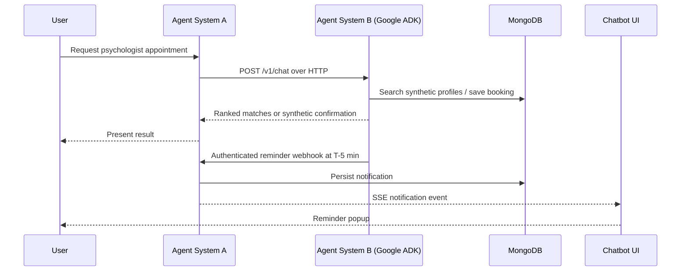
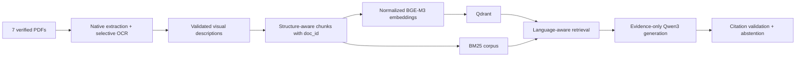

# Final-project architecture plan

## Product boundary

The product is a production-style **multi-agent first-aid response system** for
English and Arabic users. It can explain evidence-supported first-aid guidance,
apply deterministic safety and scope gates, and coordinate non-RAG tasks through
specialists and an independently deployed second agent system.

RAG is deliberately scoped as a specialist agent. It does not act as the
supervisor and it does not define the whole final project.

## Required service boundaries

| Container | Responsibility | Boundary |
|---|---|---|
| `agent-system-a` | LangGraph supervisor, safety/scope specialist, first-aid RAG specialist, coordination specialist, FastAPI, SSE, sessions | Primary Python service |
| `agent-system-b` | Independent Google ADK mental-health appointment agent with its own FastAPI API, synthetic provider catalog, booking workflow, and reminder scheduler | Network-only HTTP integration; never imported by System A |
| `mcp-server` | Two first-aid domain tools with real docstrings: `get_first_aid_protocol` (structured step checklist) and `assess_burn_severity` (deterministic triage calculator) | Separate MCP container (Streamable HTTP), called by the `protocol_tools` specialist in Agent System A over the network, never imported |
| `vector-db` | Qdrant collection and payload indexes | Separate Qdrant container |
| `chatbot-ui` | Chat UI and API reverse proxy | Separate Nginx container on port 3000 |
| `mongodb` | Durable conversations and ordered message history | Separate MongoDB container |

Each application service has its own Dockerfile and requirements file. The root
`docker-compose.yml` starts the implemented services with one command.

## Agent System A

The LangGraph supervisor will route to meaningful specialists:

1. `safety_scope_agent`: handles emergency escalation, deterministic medical
   safety gates, and administrative/out-of-scope requests.
2. `first_aid_rag_agent`: retrieves from the seven manuals, generates only from
   evidence, validates citation labels, and abstains when evidence is
   insufficient.
3. `web_agent` and `visual_agent`: handle current web information and user
   images without replacing manual-grounded first-aid evidence.
4. `appointment_agent`: calls Agent System B over HTTP and passes its synthetic
   matches or appointment confirmation back unchanged.
5. `protocol_tools_agent`: calls the standalone `mcp-server` over the network
   (MCP Streamable HTTP) for a deterministic, non-RAG structured protocol
   checklist or a burn-severity triage calculation.

All loops have iteration limits. Every external call has an explicit timeout
and handled error response. Input and output guards live at the primary-system
boundary.

## Agent System B and reminder flow

Agent B owns psychologist, appointment, and request state. Agent A remains the
only primary conversational interface. The two services share no Python imports
and communicate only through their versioned HTTP APIs. Reminder delivery is
deduplicated, retried a bounded number of times, and authenticated with the
`INTERNAL_SERVICE_TOKEN` environment variable.

## RAG specialist data flow

The complete flow is implemented modularly. Managed document deletion updates
both Qdrant and BM25.

## Requirements traceability

| Final-project requirement | Planned evidence |
|---|---|
| Two independent agent systems | Two containers and HTTP/A2A contract tests |
| RAG pipeline | First-aid RAG specialist with ingestion, chunking, BGE-M3, Qdrant, BM25, grounded generation |
| MCP server | `mcp-server` container (`mcp-server/`), two tested domain tools, called by System A's `protocol_tools` specialist over Streamable HTTP |
| Dockerized microservices | Root Compose file plus one Dockerfile and requirements file per service |
| API layer | POST chat/query APIs, SSE on at least one endpoint, persistent sessions, safe errors/timeouts |
| Guardrails | Input/output guards, deterministic safety gates, loop limits, external-call timeouts |
| Evaluation | Frozen ground-truth set, retrieval/generation metrics, routing and tool-selection accuracy |
| Configuration comparisons | At least two measured comparisons retained in the evaluation report |
| Failure analysis | Three documented failures classified as model, prompt, or design failures |

