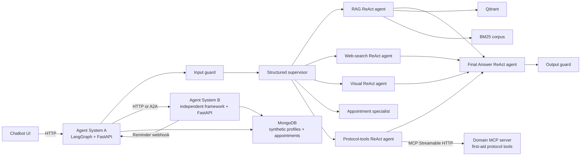

# First-Aid Multi-Agent Response System

This is the final-project repository for a production-oriented, multilingual
first-aid assistance system. The final product is a **multi-agent system**; RAG
is one specialist capability inside it, not the entire application.

The repository contains the primary LangGraph service under `agent-system-a/`,
the independent Google ADK appointment service under `agent-system-b/`, and an
independent chatbot frontend. RAG remains one specialist inside System A.

## Target architecture



- **Agent System A** is the primary LangGraph service. Its explicit StateGraph
  routes requests in parallel to compiled LangGraph ReAct specialists.
- **First-aid RAG agent** is a System A specialist that owns grounded
  retrieval and citation-backed answers from the seven manuals.
- **Web-search agent** handles explicitly current public information and returns
  source URLs; it does not replace the manuals for first-aid technique.
- **Visual agent** analyzes user-attached images with Qwen3-VL through
  OpenRouter and falls back to local Qwen2.5-VL through Ollama. Manual-page
  rendering remains local. Both paths enforce non-diagnosis and evidence-only
  constraints.
- **Protocol-tools agent** calls the standalone `mcp-server` over the network
  (MCP Streamable HTTP transport, never a Python import) for deterministic,
  non-RAG first-aid capabilities: an ordered step-by-step protocol lookup
  (`get_first_aid_protocol`) and a burn-severity triage calculator
  (`assess_burn_severity`). It is a distinct capability from the RAG
  specialist, not a re-implementation of it.
- **Agent System B** is a separately deployed Google ADK service. System A
  delegates mental-health appointment requests to it over HTTP; System B
  searches and ranks synthetic profiles, creates synthetic appointments, and
  sends a reminder webhook to System A five minutes before an appointment.
- **Qdrant**, **MongoDB**, **mcp-server**, and the **chatbot frontend** each
  run in their own container.

See [ARCHITECTURE.md](ARCHITECTURE.md) for the requirements mapping and service
boundaries.

## Run the API and chatbot UI

The API supports grounded chat, asynchronous PDF ingestion through the full
pipeline, job-status polling, and document deletion from both Qdrant and BM25.
Agent System A exposes both JSON chat at `POST /v1/chat` and SSE chat at
`POST /v1/chat/stream`; the streaming endpoint sends status/heartbeat events
while the graph runs and then the same validated, persisted result payload.

```powershell
$env:PYTHONPATH = "agent-system-a/src"
python -m uvicorn api.main:app --host 127.0.0.1 --port 8000
```

Start the current services with one command:

```powershell
docker compose up -d --build
```

### Configure OpenRouter for uploaded images

Create a key in the OpenRouter dashboard, copy `.env.example` to `.env`, and
set the key only in the local `.env` file:

```env
UPLOAD_VISION_PROVIDER=auto
UPLOAD_VISION_MODEL=qwen/qwen3-vl-32b-instruct
UPLOAD_VISION_FALLBACK_MODEL=qwen2.5vl:7b
UPLOAD_VISION_TIMEOUT_SECONDS=30
OPENROUTER_API_KEY=your_openrouter_key
OPENROUTER_BASE_URL=https://openrouter.ai/api/v1
```

With `auto`, uploaded images use OpenRouter when the key is present and fall
back to the local Ollama vision model if the remote request fails. PDF visual
ingestion remains local through `INGEST_VISION_MODEL=qwen2.5vl:7b`. The real
`.env` is ignored by Git and must never be committed. Because uploaded images
may leave the local machine, the frontend warns users not to submit identifiable
or sensitive images.

- Chatbot UI: `http://127.0.0.1:3000`
- Agent System A API docs: `http://127.0.0.1:8000/docs`
- Agent System B API docs: `http://127.0.0.1:8001/docs`
- MCP server (Streamable HTTP): `http://127.0.0.1:8002/mcp`

See
[agent-system-a/API.md](agent-system-a/API.md) for endpoint examples and the
document lifecycle.

### Agent input, output, route, and error logs

Agent A writes rotating JSONL records to
`data/logs/agent_io.jsonl`. Each request produces a `request_received` event
and either `request_completed` or `request_failed`. Records include the input,
final output, routes, guard decisions, citations, provider/router errors,
specialist failures, and latency. Uploaded image bytes, base64 manual renders,
and API keys are never written.

```powershell
Get-Content data\logs\agent_io.jsonl -Tail 20
Get-Content data\logs\agent_io.jsonl -Wait
```

The default rotation is 10 MB with five backups and can be changed through
`AGENT_LOG_MAX_BYTES` and `AGENT_LOG_BACKUP_COUNT`.

## RAG extraction foundation

The seven source PDFs in `data/source_documents/` are fixed in
`data/source_registry.json`, including their
expected SHA256 hashes. Every extraction run verifies those hashes before
reading a page. Native text is extracted page by page with PyMuPDF, assessed
with the same quality thresholds as the original v1 notebook, and only failed
pages are rendered for English or Arabic PaddleOCR.

Use the existing `FirstAidResponder_RAG` Conda environment on this machine, or
install `agent-system-a/requirements.txt` into another Python environment.

```powershell
python agent-system-a/scripts/run_extraction.py --native-only
python agent-system-a/scripts/run_extraction.py
python agent-system-a/scripts/validate_extraction.py
python agent-system-a/scripts/export_extraction_review.py
```

Use `validate_extraction.py` for routine checks of completed artifacts. It is
read-only and does not rerun native extraction or PaddleOCR.

Extraction outputs are written to `data/extraction/`:

- `native_page_records.jsonl`: native extraction and gate metrics for all pages
- `page_records.jsonl`: final selected native/OCR text for all pages
- `extraction_summary.json`: run state, method counts, and comparison with v1
- `page_images/`: cached renders only for OCR-routed pages

The OCR pass is resumable through a checkpoint. The final JSONL is considered
ready only when `extraction_summary.json` says `status: complete` and
`large_deviation: false`.

## Scope status

| Area | Status |
|---|---|
| Seven source manuals and SHA256 registry | Ready |
| Native extraction and deterministic quality gate | Ready and verified |
| Selective English/Arabic PaddleOCR | Ready and verified |
| RAG chunking, embeddings, Qdrant, retrieval | Ready and verified |
| Evidence-grounded Qwen3 4B generation | Ready and evaluated |
| FastAPI chat and managed-document lifecycle | Ready and tested |
| Explicit LangGraph guards, supervisor, parallel specialists, and answer node | Implemented and tested |
| Independent Google ADK Agent System B over HTTP | Ready and tested |
| Synthetic psychologist search, ranking, booking, and five-minute reminders | Ready and tested |
| Independent chatbot UI container and Docker proxy | Ready and tested |
| MongoDB conversation persistence | Ready and tested |
| MCP server (`mcp-server`) with two first-aid tools, called by System A over Streamable HTTP | Ready and tested |
| Complete Docker service layout (6 containers via one `docker-compose up`) | Ready |
| Retrieval and generation evaluation | Completed |

## Frozen evaluation data

The fixed 220-record v1.2 evaluation asset is stored under the simple project
name `data/evaluation/golden_dataset.json`. Its version, record count, and SHA256
are validated before every evaluation, so the shorter filename does not weaken
the dataset freeze.
